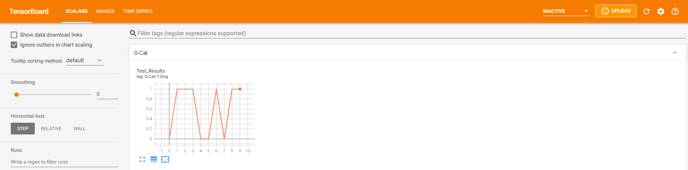
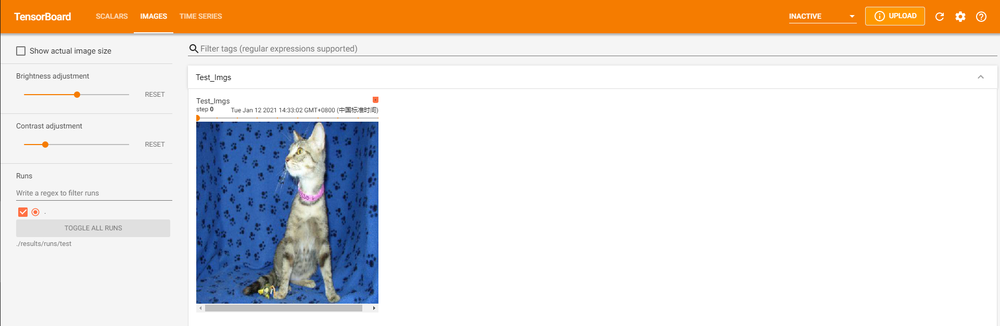
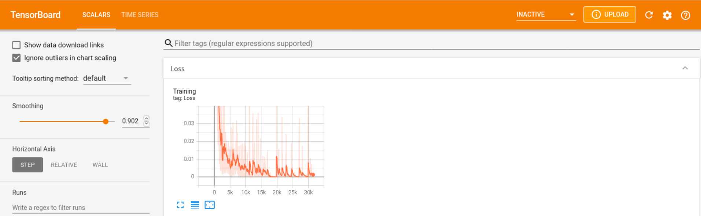

# **AlexNet-2012**

## **网络说明**

（1） 年份：2012

（2） 作者：Alex Krizhevsky, Ilya Sutskever, Geoffrey E. Hinton（深度学习三巨头之一）

（3） 机构：University of Toronto （多伦多大学）

（4） 论文：ImageNet Classification with Deep Convolutional Neural Networks

（5） 收录：NIPS-2012（机器学习领域顶级会议）

（6） 荣耀：ILSVRC-2012 冠军（ImageNet大规模视觉挑战赛）

（7） 原文数据集： ImageNet


## **论文贡献**

（1） 使用 ReLU 激活函数加速收敛，替代常用的 Sigmoid

（2） 使用 GPU 并行加速训练，将网络拆分布局在双显卡（网络架构图拆分成两部分的原因）

（3） 提出 Dropout 算法，使用数据增强手段防止过拟合


## **总结与引用**

（1） LeNet-5 网络的放大版本，深度学习网络参数开始向 “大规模” 发展

（2） AlexNet 是近代深度学习兴起，卷积神经网络开始成为计算机视觉核心算法的标志性成果

```
@inproceedings{Krizhevsky12imagenetclassification,
    author = {Alex Krizhevsky and Ilya Sutskever and Geoffrey E Hinton},
    title = {Imagenet classification with deep convolutional neural networks.},
    booktitle = {In Advances in the Neural Information Processing System,},
    year = {2012}
}
```

## **测试环境**

* Ubuntu 18.04
* Pytorch >= 1.6 (test in 1.6)
* Python 3.7

```
# 创建 Anaconda 环境
conda create -n AlexNet python=3.7

# 激活环境
conda activate AlexNet

# 根据电脑情况在下方网站自行安装 Pytorch
https://pytorch.org/get-started/locally/

# 将项目克隆到本地
git clone https://github.com/IN2-ViAUn/20210108-ViAUn-001.git

# 安装依赖库
pip install -r requirements.txt
```
## **路径设置**

* 训练与测试数据集路径：Classical_AlexNet.yaml -> data
* 训练模型保存路径：Classical_AlexNet.yaml -> train_params
* 前向测试过程模型载入路径：Classical_AlexNet.yaml -> test_params
* 训练与测试日志文件存档路径：Classical_AlexNet.yaml -> log_params
* tensorboard 可视化缓存路径：Classical_AlexNet.yaml -> tensorboard_params

## **数据集说明**

* 本代码使用的训练数据集为 [Dogs vs. Cats](https://www.kaggle.com/c/dogs-vs-cats-redux-kernels-edition)
* 数据集的文件夹结构应该按照如下格式设置：

```
datasets/ ($DATA_DIR)
|-- test1
|   |-- 1.jpg
|   |-- 2.jpg
|   |-- 3.jpg
|   `-- ...
`-- train
|   |-- cats
|   |   |-- cat.0.jpg
|   |   |-- cat.1.jpg
|   |   |-- cat.2.jpg
|   |   `-- ...
|   |-- dogs
|   |   |-- dog.0.jpg
|   |   |-- dog.1.jpg
|   |   |-- dog.2.jpg
|   |   `-- ...
```
## **前向测试**

* 下载预训练好的网络模型：[链接](https://pan.baidu.com/s/1baLG0W_feZNlwGyfil9vSA) （提取码：0000）
* 修改测试数据集路径：**训练与测试数据集路径**
* 将下载好的 .pth 文件放入自定义文件夹，修改：**前向测试过程模型载入路径**
* 切换到 2012-AlexNet 目录下，运行指令：

```
python test.py ./config/Classical_AlexNet.yaml 
```
* 待处理完毕后，运行指令：
```
tensorboard --logdir=./results/runs/test
```
* 利用 tensorboard 工具查看分类结果，打开网页 SCALAR 中水平坐标表示索引图片的序号，垂直坐标表示猫和狗的分类结果，0表示猫，1表示狗（注意将浏览器左侧的 Smoothing 选项调置0），如图:

<p align="center">

<p/>

* 利用 tensorboard 工具查看分类结果，打开网页 IMAGES 可以手动滑动测试图片，与 SCALAR 中的结果对比判断，如图:

<p align="center">

<p/>

* 参数说明：

```
# 必选参数：
config -> 保证网络模型工作的参数保存文件 

# 可选参数：
--log -> 在执行指令时发生调用，会生成相应的 log 文件，记录代码过程发生的事件
```

## **网络模型训练**

* 修改测试数据集路径：**训练与测试数据集路径**
* 切换到 2012-AlexNet 目录下，运行指令：

```
python train.py ./config/Classical_AlexNet.yaml --tensorboard --delet 
```
* 训练过程中另启动终端命令行，运行指令：
```
tensorboard --logdir=./results/runs/train
```

* 利用 tensorboard 工具查看训练结果，打开网页 SCALARS，即可显示 训练损失-训练轮数 之间的关系，如图：

<p align="center">

<p/>

* 参数说明：

```
# 必选参数：
config -> 保证网络模型工作的参数保存文件 

# 可选参数：
--log -> 在执行指令时发生调用，会生成相应的 log 文件，记录代码过程发生的事件
--tensorboard -> 在执行指令时发生调用，会生成 tensorboard 文件，可用工具查看训练过程
--delet -> 在执行指令时发生调用，会每次删除过去的训练文件，保留最新的训练结果
```
## **涉及工具项**
* yaml 配置文件的读取使用
* tensorboard 可视化工具的使用
* tqdm 命令行进度条工具的使用
* PIL 图像处理包读取图片使用
* pathlib 路径管理包使用
* setproctitle 进程命名管理工具使用

## **版本说明**
* 20210112 首次发布-V1.0版